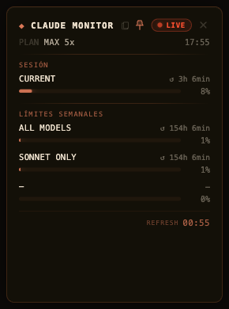

# ◆ Claude Monitor

A minimal, frameless macOS desktop widget that shows your Claude usage limits in real time. Terminal aesthetic. Zero pip dependencies.



---

## Requirements

| | |
|---|---|
| **macOS** | 12 Monterey or later |
| **Python 3** | Pre-installed on all modern macOS |
| **Xcode Command Line Tools** | For compiling the native window (`xcode-select --install`) |
| **Claude account** | Logged into [claude.ai](https://claude.ai) in any browser |

---

## Quick start

```bash
git clone https://github.com/YOUR_GITHUB_USERNAME/claude-monitor.git
cd claude-monitor
./install.sh
```

That's it. `install.sh` compiles the app, registers auto-start on login, and opens the widget immediately. You never need to run anything again — use **⌥⌘C** from any app to show or hide it.

---

## Connecting to live data

On first launch the widget shows a **SETUP** screen. The recommended way to go live is the
browser extension — install it **once** and the widget stays live forever, with **zero**
manual steps after that. No console, no re-pasting.

### Install the extension (recommended — install once)

1. In Chrome (or Brave/Edge) open **`chrome://extensions`** and turn on **Developer mode** (top-right)
2. Click **Load unpacked** and select the **`extension/`** folder inside this repo
3. Make sure you're logged into **[claude.ai](https://claude.ai)** in that browser

That's it. The extension runs silently in the background — **no tab, no popup, no UI**. It
polls your usage every 60 seconds (even with no claude.ai tab open, as long as the browser is
running and you're logged in) and pushes it to the local widget server. The widget shows
**● LIVE** and stays that way.

> **Is the extension free?** Yes. Loading an unpacked extension from this folder costs
> nothing — the $5 fee only applies to *publishing* on the Chrome Web Store. The only
> tradeoff: unpacked extensions don't auto-update, so if you pull new code, click the
> **reload** icon on the extension in `chrome://extensions`.

### Fallback: paste a snippet (no extension)

If you'd rather not install the extension, click the **clipboard icon** in the widget header
to copy a snippet, open **claude.ai** → DevTools console (**⌘ Option I**), paste, and press
**Enter**. Downside: it only runs while that tab is open — close it and you must re-paste.

> Both paths run entirely inside your browser's authenticated session — usage is fetched
> from claude.ai and POSTed to the local server on `127.0.0.1:2727`. Nothing leaves your machine.

---

## What the widget shows

| Row | What it means |
|---|---|
| **Session** | Your 5-hour rolling usage window (resets automatically) |
| **All Models** | 7-day usage across all Claude models |
| **Sonnet Only** | 7-day usage for Claude Sonnet specifically |
| **Claude Design** | 7-day usage for Claude's design features |

The **↺ Xh Xmin** timestamp next to each row shows when that limit resets.

---

## Controls

| | |
|---|---|
| **⌥⌘C** | Global hotkey — show or hide the widget from any app, any time |
| **Drag** | Click and drag anywhere on the widget to reposition it |
| **Resize** | Drag any edge or corner to resize |
| **Pin button** (📍) | Toggle always-on-top. Orange = pinned above all windows. Dim = normal window level |
| **Close button** (✕) | Hides the widget. The process stays alive, so **⌥⌘C** brings it right back |

---

## Stopping

The widget runs as two LaunchAgents (auto-start on login + crash recovery). To stop it
completely and disable auto-start:

```bash
launchctl unload ~/Library/LaunchAgents/com.claudewidget.window.plist
launchctl unload ~/Library/LaunchAgents/com.claudewidget.server.plist
```

To remove it entirely, also delete those two `.plist` files. Re-running `./install.sh`
reinstalls and restarts everything.

> The **✕** button only *hides* the widget — it keeps running so the hotkey can reopen it.

---

## Customisation

| What | Where |
|---|---|
| Window size | `let w` / `let h` in `widget-window.swift` (default `290×390`) |
| Window position | `x` / `y` in `widget-window.swift` (default top-right) |
| Poll interval (data push) | `POLL_MINUTES` in `extension/background.js` (default 1 = 60s; Chrome's minimum) |
| Widget refresh (UI poll) | `countdown = 60` in `widget.html` |
| Minimum size | `panel.minSize` in `widget-window.swift` |

---

## How it works

```
claude.ai (your browser)
  └─ extension/background.js  (or the fallback console snippet)
       fetches /api/bootstrap + /api/organizations/{id}/usage every 60s
       └─ POSTs { plan, usage } to localhost:2727/api/data
             └─ server.py caches it (and to /tmp so it survives restarts)
                  └─ widget.html polls /api/usage every 60s
```

| File | Role |
|---|---|
| `server.py` | Python `http.server` on `127.0.0.1:2727`. Receives pushed data, serves JSON. |
| `widget.html` | Self-contained UI — all CSS and JS inline. |
| `widget-window.swift` | Native macOS `NSPanel` + `WKWebView`. Frameless, floating, resizable. ⌥⌘C global hotkey. |
| `extension/` | MV3 browser extension — background service worker that pushes usage automatically. |
| `run.sh` / `launch.sh` | Manual launchers (foreground / background). Normally launchd handles this. |
| `install.sh` | One-time setup: Swift compile + installs two LaunchAgents (auto-start on login + crash recovery). |

---

## Troubleshooting

**Widget shows SETUP after working before**
No fresh data has arrived for 5 minutes. If you use the extension: check you're logged into
claude.ai and that the extension is enabled in `chrome://extensions`. If you use the snippet:
the claude.ai tab was probably closed — re-paste it (or just install the extension).

**"swiftc: command not found"**
Install Xcode Command Line Tools:
```bash
xcode-select --install
```

**Port 2727 already in use**
```bash
lsof -ti:2727 | xargs kill -9
```

**Widget doesn't appear**
It launches at the top-right of your main display (`x=1100, y=44`). If you have a smaller screen, edit the coordinates in `widget-window.swift` and re-run `./install.sh`.

---

## Security

- The server binds **only** to `127.0.0.1` — not accessible from the network
- The extension / snippet runs in your browser's existing authenticated session — no credentials are stored or transmitted
- The extension only requests access to `claude.ai` and `localhost:2727` (see `extension/manifest.json`)
- The native window has no Dock icon and doesn't appear in the app switcher
